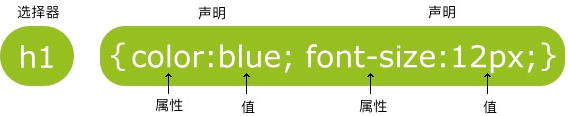

## CSS 语法
### 实例
* 查看 <a href="http://localhost:63342/CSSLearn/2_%E8%AF%AD%E6%B3%95_%E5%AE%9E%E4%BE%8B1.html?_ijt=o2qvhk7odkga60d504rdok2ngo&_ij_reload=RELOAD_ON_SAVE">实例1</a>
* 查看 <a href="http://localhost:63342/CSSLearn/2_%E8%AF%AD%E6%B3%95_%E5%AE%9E%E4%BE%8B2.html?_ijt=o2qvhk7odkga60d504rdok2ngo&_ij_reload=RELOAD_ON_SAVE">实例2</a>
### CSS 实例
CSS 规则主要由两个主要的部分构成：选择器，以及一条或多条声明：

选择器通常是您需要改变样式的 HTML 元素。
每条声明由一个属性和一个值组成。
属性（property）是您希望设置的样式属性（style attribute）。每个属性都有一个值。属性和值被冒号分开。
### CSS 实例
CSS 声明总是以分号 
<span style="background-color:blue">;</span> 
结束，声明总是以大括号
<span style="background-color:blue">{}</span>
括起来：
```css
p {color:red;text-align:center;}
```
为了让 CSS 可读性更强，你可以每行只描述一个属性：
```css
p
{
    color:red;
    text-align:center;
}
```
### CSS 注释
注释是用来解析你的代码，并且可以随意编辑它，浏览器会忽略它。

CSS 注释以
<span style="background-color:blue">\*</span>
开始，以
<span style="background-color:blue">*/</span>
结束，实例如下：
```css
/*这是个注释*/
p
{
    text-align:center;
    /*这是另一个注释*/
    color:black;
    font-family:arial;
}
```
